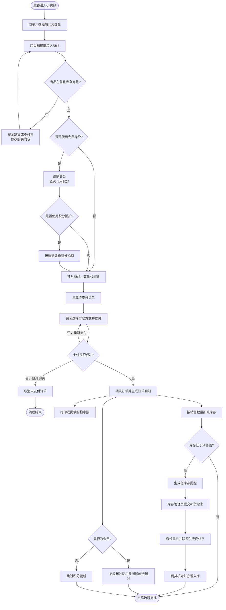

# 小卖部业务流程

## 1. 流程范围

本流程从顾客进入小卖部选购商品开始，到付款完成、订单记录生成、库存与会员积分更新结束；当库存低于预警值时，流程继续延伸至补货入库，形成经营闭环。

## 2. 主要业务流程

1. **浏览与选购**  
   顾客进入小卖部，浏览在售商品，选择商品及购买数量；需要会员权益的顾客向店员提供会员信息。

2. **商品录入与校验**  
   店员扫描商品条码或手工选择商品，系统识别商品名称和当前售价，并校验商品是否在售、库存是否满足购买数量。若商品不可售或库存不足，店员告知顾客并修改购买内容。

3. **确认订单**  
   店员与顾客核对商品、数量、单价和金额。会员可选择按规则使用积分抵扣；系统计算优惠或抵扣后的应付金额。

4. **收款结算**  
   顾客选择现金、移动支付等付款方式完成支付。支付失败时可以重新支付，顾客放弃购买时取消尚未完成的订单。

5. **完成交易**  
   支付成功后，系统确认订单，记录订单的交易时间、经办店员、会员（如有）、实付金额和付款方式，同时为每种商品生成相应的订单明细，并向顾客提供购物小票。

6. **更新库存**  
   系统按照已售商品数量扣减库存。库存变动与订单关联，便于后续核对销售记录和实际库存。

7. **更新会员积分**  
   若顾客为会员，系统记录本次积分使用情况，并按小卖部的积分规则增加本次交易所得积分；非会员交易不执行此步骤。

8. **库存预警与补货**  
   系统检查交易后的库存。库存低于预警值时生成低库存提醒；库存管理员整理补货需求并提交店长审核。供应商送货后，库存管理员核对商品与数量并办理入库，库存数量随之增加。

9. **经营查询**  
   店长可根据已完成的订单、订单明细和库存记录查看销售与库存情况，为商品定价、补货和经营决策提供依据。

## 3. 业务流程图

## 4. 关键业务规则

1. 只有在售且库存充足的商品才能进入有效结算。
2. 订单只有在付款成功后才标记为完成，并据此扣减库存。
3. 每份订单至少包含一条订单明细；订单明细记录本次交易时的商品、数量和成交单价。
4. 会员积分必须与具体会员及交易关联，积分抵扣和累积均应留下记录。
5. 未支付订单取消后不得扣减库存或增加会员积分。
6. 低库存提醒只触发补货流程，不代表商品已经入库；完成到货核对后才能增加库存。
7. 店长负责关键异常处理和审批，普通店员不能擅自更改商品售价或手工调整会员积分。

## 5. 异常情况处理

| 异常情况 | 处理方式 |
|---|---|
| 商品缺货或已停用 | 不允许结算该商品，提示顾客调整购买内容 |
| 扫码价格与货架标价不一致 | 暂停该商品结算，由店员核实并交店长处理 |
| 支付失败 | 保留待支付订单，允许顾客重新支付或取消订单 |
| 收银过程中顾客取消购买 | 修改待支付订单；若全部取消，则关闭该订单且不扣库存 |
| 交易完成后申请退货 | 店员核验原订单，符合规则的申请交由店长审核，并单独记录后续退款、库存和积分变化 |
| 盘点库存与系统库存不一致 | 库存管理员记录差异原因，提交店长审核后再调整库存 |
