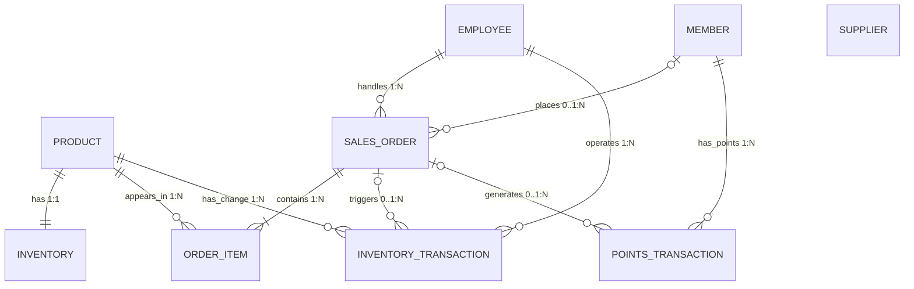

# 小卖部数据库 · 关系模式

## 0. 命名约定

| 项目 | 约定 |
| --- | --- |
| 表名 | 小写英文 + 下划线，如 `product`、`sales_order`、`order_item` |
| 字段名 | 小写英文 + 下划线，如 `product_id`、`created_at` |
| 主键后缀 | 业务对象编号统一使用 `_id`，如 `member_id` |
| 时间字段 | 使用 `_at`，如 `ordered_at`、`created_at`、`updated_at` |
| 金额字段 | 使用 `DECIMAL(10,2)`，不使用浮点数 |
| 数量字段 | 使用 `INT`，并在域中明确是否允许为负 |
| 布尔状态 | 统一使用 `BOOLEAN`（`TRUE/FALSE`） |
| 枚举状态 | 统一使用 `VARCHAR` + 中文枚举值（如 `待支付/已完成/已取消`），不混用中英文 |
| 订单表名 | 使用 `sales_order`，避免与关键字 `order` 冲突 |

> 例外：流水/日志表（`inventory_transaction`、`points_transaction`）的主码使用**自增整数**而非 `CHAR` 编号。理由：流水量远大于主数据、无业务查询含义，用自增整数更简洁，也避免编号耗尽。

---

## 1. 表清单总览

| 实体 | 表名 | 职责 | 类型 | 关键关系 |
| --- | --- | --- | --- | --- |
| 商品 | `product` | 商品主数据、当前售价、在售状态 | 核心 | 被 `inventory`、`order_item`、`inventory_transaction` 引用 |
| 库存 | `inventory` | 商品当前数量与低库存预警值 | 核心 | 一种商品对应一条库存记录 |
| 会员 | `member` | 会员身份与当前积分余额 | 核心 | 被 `sales_order`、`points_transaction` 引用 |
| 员工 | `employee` | 店员/店长等员工信息 | 核心 | 被 `sales_order`、`inventory_transaction` 引用 |
| 订单 | `sales_order` | 一次交易的总体信息 | 核心 | 一份订单包含多条明细 |
| 订单明细 | `order_item` | 订单中的商品、数量、成交单价 | 核心 | 连接订单和商品（拆解多对多） |
| 供应商 | `supplier` | 补货所需的供应商资料（参考数据） | 扩展 | 被后续补货/入库记录引用 |
| 库存变动 | `inventory_transaction` | 销售扣减、入库、盘点、退货等变动流水 | 扩展 | 关联商品、订单、操作人 |
| 积分流水 | `points_transaction` | 会员积分累积/使用/调整流水 | 扩展 | 关联会员、订单 |

> 六张核心表 + 三张扩展表。扩展表均依据第一周《数据边界》中"进库"的 `供应商`、`库存变动记录`、`积分流水` 条目加入，详见第 4 节范围说明。

---

## 2. 核心表设计

### 2.1 `product`（商品）

#### 表职责
保存商品的稳定主数据、当前售价和在售状态；**不**保存某一笔订单发生时的历史成交单价（历史成交价在 `order_item.unit_price`）。

#### 表间关系
- 一个商品对应一条 `inventory` 库存记录（1:1）。
- 一个商品可以出现在多条 `order_item` 明细中（1:N）。
- 一个商品可以产生多条 `inventory_transaction` 变动（1:N）。

#### 字段定义

| 字段名 | 类型 | 长度/精度 | 可空 | 默认值 | 域/取值范围 | 含义 | 键标记 |
| --- | --- | --- | --- | --- | --- | --- | --- |
| `product_id` | CHAR | 4 | 否 | 无 | `P000`—`P999` | 商品内部编号 | PK |
| `barcode` | VARCHAR | 20 | 否 | 无 | 门店内唯一 | 扫码识别码 | UNIQUE（候选码） |
| `product_name` | VARCHAR | 100 | 否 | 无 | 非空字符串 | 商品名称 | — |
| `category` | VARCHAR | 30 | 否 | 无 | 乳品/饮料/零食/日用品 | 商品分类 | — |
| `unit_price` | DECIMAL | 10,2 | 否 | `0.00` | `≥ 0` | 当前售价 | — |
| `is_active` | BOOLEAN | — | 否 | `TRUE` | `TRUE/FALSE` | 是否在售 | — |
| `created_at` | DATETIME | — | 否 | 当前时间 | 合法时间 | 建档时间 | — |

#### 键说明
- **主码**：`product_id`（稳定内部编号，不因改名/改价而变化）。
- **候选码**：`barcode`——门店内每条商品有唯一条码，用于扫码识别。
- **外码**：无（商品是最上游的主数据）。

---

### 2.2 `inventory`（库存）

#### 表职责
保存商品的当前库存数量与低库存预警值。库存是"当前快照"，与 `product` 一一对应。

#### 表间关系
- 每条库存记录必须对应一个已登记商品（`product` 1:1 `inventory`）。

#### 字段定义

| 字段名 | 类型 | 长度/精度 | 可空 | 默认值 | 域/取值范围 | 含义 | 键标记 |
| --- | --- | --- | --- | --- | --- | --- | --- |
| `product_id` | CHAR | 4 | 否 | 无 | 必须存在于 `product` | 库存对应商品 | PK、FK → `product.product_id` |
| `quantity` | INT | — | 否 | `0` | `≥ 0`（不允许为负） | 当前库存数量 | — |
| `reorder_level` | INT | — | 否 | `0` | `≥ 0` | 低库存预警值 | — |
| `updated_at` | DATETIME | — | 否 | 当前时间 | 合法时间 | 最近更新时间 | — |

#### 键说明
- **主码**：`product_id`——直接复用商品编号，天然实现 1:1 约束。
- **外码**：`product_id` 引用 `product.product_id`。
- 库存数量的**增减明细**不在本表保存，由扩展表 `inventory_transaction` 追溯。

---

### 2.3 `member`（会员）

#### 表职责
保存会员身份资料与当前积分余额。积分余额是"当前值"，每笔变动由 `points_transaction` 追溯。

#### 表间关系
- 一个会员可以有多笔订单（1:N，见 `sales_order.member_id`）。
- 一个会员可以有多条积分流水（1:N，见 `points_transaction`）。

#### 字段定义

| 字段名 | 类型 | 长度/精度 | 可空 | 默认值 | 域/取值范围 | 含义 | 键标记 |
| --- | --- | --- | --- | --- | --- | --- | --- |
| `member_id` | CHAR | 5 | 否 | 无 | `M0000`—`M9999` | 会员内部编号 | PK |
| `member_no` | VARCHAR | 20 | 否 | 无 | 门店内唯一 | 会员卡号 | UNIQUE（候选码） |
| `member_name` | VARCHAR | 50 | 否 | 无 | 非空字符串 | 会员姓名 | — |
| `phone` | VARCHAR | 20 | 是 | `NULL` | 合法手机号或 `NULL` | 联系方式 | — |
| `points_balance` | INT | — | 否 | `0` | `≥ 0` | 当前积分余额 | — |
| `created_at` | DATETIME | — | 否 | 当前时间 | 合法时间 | 注册时间 | — |

#### 键说明
- **主码**：`member_id`（稳定内部编号，不把手机号当主码）。
- **候选码**：`member_no`——会员卡号在门店内唯一。
- **条件候选码**：`phone`——仅当业务规则确认"一个手机号只能绑定一个会员"时才可加 UNIQUE。本设计默认**不**设唯一约束，因为会员可能家庭共用手机号；如需唯一性，在第三周 DDL 中补 `UNIQUE` 即可。

---

### 2.4 `employee`（员工）

#### 表职责
保存店员、店长、库存管理员等员工信息，用于订单记录经办人和后续权限控制。

#### 表间关系
- 一个员工可以经办多笔订单（1:N，见 `sales_order.employee_id`）。
- 一个员工可以产生多条库存变动操作（1:N，见 `inventory_transaction.operator_id`）。

#### 字段定义

| 字段名 | 类型 | 长度/精度 | 可空 | 默认值 | 域/取值范围 | 含义 | 键标记 |
| --- | --- | --- | --- | --- | --- | --- | --- |
| `employee_id` | CHAR | 5 | 否 | 无 | `E0000`—`E9999` | 员工编号 | PK |
| `employee_no` | VARCHAR | 20 | 否 | 无 | 门店内唯一 | 员工工号 | UNIQUE（候选码） |
| `employee_name` | VARCHAR | 50 | 否 | 无 | 非空字符串 | 员工姓名 | — |
| `role` | VARCHAR | 20 | 否 | 无 | 店长/店员/库存管理员 | 工作角色 | — |
| `is_active` | BOOLEAN | — | 否 | `TRUE` | `TRUE/FALSE` | 是否在职 | — |

#### 键说明
- **主码**：`employee_id`。
- **候选码**：`employee_no`——员工工号门店内唯一。

---

### 2.5 `sales_order`（订单）

#### 表职责
保存一次交易的总体信息：下单时间、经办店员、关联会员（可有可无）、应付总额、付款方式、状态。**不**保存订单里的具体商品（商品在 `order_item`）。

#### 表间关系
- 每笔订单有一个经办员工（`employee` 1:N `sales_order`）。
- 每笔订单最多关联一个会员，非会员订单可为空（`member` 0..1:N `sales_order`）。
- 一份订单包含一条或多条明细（`sales_order` 1:N `order_item`）。

#### 字段定义

| 字段名 | 类型 | 长度/精度 | 可空 | 默认值 | 域/取值范围 | 含义 | 键标记 |
| --- | --- | --- | --- | --- | --- | --- | --- |
| `order_id` | CHAR | 7 | 否 | 无 | `O000001`—`O999999` | 订单编号 | PK |
| `ordered_at` | DATETIME | — | 否 | 当前时间 | 合法时间 | 下单时间 | — |
| `employee_id` | CHAR | 5 | 否 | 无 | 必须存在于 `employee` | 经办店员 | FK → `employee.employee_id` |
| `member_id` | CHAR | 5 | 是 | `NULL` | 存在于 `member` 或 `NULL` | 关联会员 | FK → `member.member_id` |
| `total_amount` | DECIMAL | 10,2 | 否 | `0.00` | `≥ 0` | 订单应付总额 | — |
| `payment_method` | VARCHAR | 20 | 否 | 无 | 现金/移动支付 | 付款方式 | — |
| `status` | VARCHAR | 20 | 否 | `待支付` | 待支付/已完成/已取消 | 订单状态 | — |

#### 键说明
- **主码**：`order_id`。
- **外码**：`employee_id`（不可空，每笔订单都必须知道由谁经办）；`member_id`（可空，允许非会员购买）。

---

### 2.6 `order_item`（订单明细）

#### 表职责
保存订单中每一行商品、购买数量、成交单价与本行金额。它把"订单 ↔ 商品"的多对多关系拆成一笔订单下的多条明细，是本周最关键的一张表。

#### 表间关系
- 每条明细属于一个订单（`sales_order` 1:N `order_item`）。
- 每条明细对应一个商品（`product` 1:N `order_item`）。

#### 字段定义

| 字段名 | 类型 | 长度/精度 | 可空 | 默认值 | 域/取值范围 | 含义 | 键标记 |
| --- | --- | --- | --- | --- | --- | --- | --- |
| `order_id` | CHAR | 7 | 否 | 无 | 必须存在于 `sales_order` | 所属订单 | PK（联合）、FK → `sales_order.order_id` |
| `product_id` | CHAR | 4 | 否 | 无 | 必须存在于 `product` | 购买商品 | PK（联合）、FK → `product.product_id` |
| `quantity` | INT | — | 否 | 无 | `> 0`（不允许为 0 或负） | 购买数量 | — |
| `unit_price` | DECIMAL | 10,2 | 否 | 无 | `≥ 0` | 本次交易成交单价 | — |
| `line_amount` | DECIMAL | 10,2 | 否 | 无 | `≥ 0`，通常 `= quantity × unit_price` | 本行金额 | — |

#### 键说明
- **联合主码**：`(order_id, product_id)`——表示"同一订单中同一种商品只出现一行"。若业务允许同一商品因不同优惠拆成多行，则需增加 `item_no` 行号字段，主码改为 `(order_id, item_no)`。
- **外码**：`order_id` 引用 `sales_order.order_id`；`product_id` 引用 `product.product_id`。
- **为什么存 `unit_price`**：商品表存的是"当前售价"，明细表存的是"交易当时的成交单价"，这样改价后仍能还原历史成交金额。

---

## 3. 扩展表设计（可选）

### 3.1 `supplier`（供应商）

#### 表职责
保存补货采购所需的供应商参考资料。供应商不直接操作门店内部数据，只参与供货协作。

#### 字段定义

| 字段名 | 类型 | 长度/精度 | 可空 | 默认值 | 域/取值范围 | 含义 | 键标记 |
| --- | --- | --- | --- | --- | --- | --- | --- |
| `supplier_id` | CHAR | 4 | 否 | 无 | `S000`—`S999` | 供应商编号 | PK |
| `supplier_name` | VARCHAR | 100 | 否 | 无 | 非空字符串 | 供应商名称 | — |
| `contact_person` | VARCHAR | 50 | 是 | `NULL` | 非空字符串或 `NULL` | 联系人 | — |
| `phone` | VARCHAR | 20 | 是 | `NULL` | 合法手机号或 `NULL` | 联系电话 | — |
| `is_active` | BOOLEAN | — | 否 | `TRUE` | `TRUE/FALSE` | 是否合作中 | — |
| `created_at` | DATETIME | — | 否 | 当前时间 | 合法时间 | 建档时间 | — |

> 说明：本周尚未建模"补货需求 / 入库记录"，因此 `supplier` 暂无外码关系，只作参考主数据，待后续周次被入库/补货记录引用。

### 3.2 `inventory_transaction`（库存变动）

#### 表职责
追踪销售扣减、入库、盘点调整、退货等每一次库存变化，支撑库存核对与追溯。

#### 字段定义

| 字段名 | 类型 | 长度/精度 | 可空 | 默认值 | 域/取值范围 | 含义 | 键标记 |
| --- | --- | --- | --- | --- | --- | --- | --- |
| `transaction_id` | INT | — | 否 | 自增 | 自增唯一 | 变动记录编号 | PK |
| `product_id` | CHAR | 4 | 否 | 无 | 必须存在于 `product` | 变动商品 | FK → `product.product_id` |
| `change_type` | VARCHAR | 20 | 否 | 无 | 入库/销售扣减/盘点调整/退货 | 变动类型 | — |
| `quantity_change` | INT | — | 否 | 无 | 可为正负（入库为正、扣减为负） | 变动数量 | — |
| `related_order_id` | CHAR | 7 | 是 | `NULL` | 存在于 `sales_order` 或 `NULL` | 关联订单 | FK → `sales_order.order_id` |
| `operator_id` | CHAR | 5 | 否 | 无 | 必须存在于 `employee` | 操作人 | FK → `employee.employee_id` |
| `created_at` | DATETIME | — | 否 | 当前时间 | 合法时间 | 变动时间 | — |

#### 键说明
- **主码**：`transaction_id`（自增）。
- **外码**：`product_id`（不可空）、`operator_id`（不可空）、`related_order_id`（可空，入库/盘点等无订单的变动为空）。
- **符号规则**：`quantity_change` 入库为正、销售扣减/退货为负——这是"数量字段是否允许为负"的明确约定。

### 3.3 `points_transaction`（积分流水）

#### 表职责
记录会员每一笔积分累积/使用/调整，实现"积分余额 + 流水"的完整追溯（对应第一周数据边界的 `积分流水`）。

#### 字段定义

| 字段名 | 类型 | 长度/精度 | 可空 | 默认值 | 域/取值范围 | 含义 | 键标记 |
| --- | --- | --- | --- | --- | --- | --- | --- |
| `points_transaction_id` | INT | — | 否 | 自增 | 自增唯一 | 积分流水编号 | PK |
| `member_id` | CHAR | 5 | 否 | 无 | 必须存在于 `member` | 所属会员 | FK → `member.member_id` |
| `order_id` | CHAR | 7 | 是 | `NULL` | 存在于 `sales_order` 或 `NULL` | 关联订单 | FK → `sales_order.order_id` |
| `change_type` | VARCHAR | 20 | 否 | 无 | 累积/使用/调整 | 变动类型 | — |
| `points_change` | INT | — | 否 | 无 | 可为正负（累积为正、使用为负） | 变动积分 | — |
| `balance_after` | INT | — | 否 | 无 | `≥ 0` | 变动后积分余额 | — |
| `created_at` | DATETIME | — | 否 | 当前时间 | 合法时间 | 变动时间 | — |

#### 键说明
- **主码**：`points_transaction_id`（自增）。
- **外码**：`member_id`（不可空）、`order_id`（可空，初始赠送/手工调整无订单）。

---

## 4. 未纳入本周的表（范围说明）

第一周《数据边界》还列出了 `补货需求`、`入库记录`、`盘点记录`、`退货/退款记录`。本周**先不**为它们单独建表，理由：

| 信息 | 本周处理 | 理由 |
| --- | --- | --- |
| 补货需求 | 暂不建表 | 涉及"提交 → 店长审核"审批流程，留待第三/四周 |
| 入库记录 | 由 `inventory_transaction`（`change_type=入库`）追踪 | 数量变化已可追溯，独立建表增加冗余 |
| 盘点记录 | 由 `inventory_transaction`（`change_type=盘点调整`）追踪 + 后续补审批 | 差异原因与审核待权限周次细化 |
| 退货/退款记录 | 暂不建表 | 涉及退款金额、库存回补、积分回退的多表联动，留待后续周次 |

> 原则：本周不"为了看起来完整"随意加表；每张表、每个字段都必须能说明它服务哪条业务流程。

---

## 5. 表间关系

### 5.1 基数关系

| 关系 | 基数 | 说明 |
| --- | --- | --- |
| `product` ↔ `inventory` | 1:1 | 一个商品有一条当前库存记录；库存记录必须对应一个商品 |
| `employee` ↔ `sales_order` | 1:N | 一个员工可经办多笔订单；一笔订单由一个员工经办 |
| `member` ↔ `sales_order` | 0..1:N | 一个会员可有多笔订单；一笔订单最多关联一个会员（非会员为空） |
| `sales_order` ↔ `order_item` | 1:N | 一笔订单至少包含一条明细 |
| `product` ↔ `order_item` | 1:N | 一个商品可出现在多笔订单明细中 |
| `sales_order` ↔ `product` | 多对多 | 通过 `order_item` 拆解 |
| `product` ↔ `inventory_transaction` | 1:N | 一个商品可产生多条库存变动 |
| `employee` ↔ `inventory_transaction` | 1:N | 一个员工可执行多条库存变动 |
| `sales_order` ↔ `inventory_transaction` | 0..1:N | 已完成的订单触发扣减；待支付/取消订单不触发 |
| `member` ↔ `points_transaction` | 1:N | 一个会员可有多条积分流水 |
| `sales_order` ↔ `points_transaction` | 0..1:N | 会员的已完成订单产生积分；非会员/未支付不产生 |

### 5.2 ER 图

---

## 6. 键总结

### 6.1 主码汇总

| 表 | 主码 | 说明 |
| --- | --- | --- |
| `product` | `product_id` | 稳定内部编号 |
| `inventory` | `product_id` | 复用商品编号，实现 1:1 |
| `member` | `member_id` | 稳定内部编号 |
| `employee` | `employee_id` | 稳定内部编号 |
| `sales_order` | `order_id` | 订单编号 |
| `order_item` | `(order_id, product_id)` | 联合主码 |
| `supplier` | `supplier_id` | 稳定内部编号 |
| `inventory_transaction` | `transaction_id` | 自增 |
| `points_transaction` | `points_transaction_id` | 自增 |

### 6.2 候选码汇总

| 表 | 候选码 | 唯一性依据 |
| --- | --- | --- |
| `product` | `barcode` | 门店内每条商品有唯一条码，用于扫码识别 |
| `member` | `member_no` | 会员卡号门店内唯一 |
| `employee` | `employee_no` | 员工工号门店内唯一 |
| `member` | `phone`（条件） | 仅当业务规定"一个手机号只对应一个会员"；本设计默认不设唯一，因可能家庭共用手机号 |

### 6.3 外码汇总

| 外码字段 | 引用字段 | 可空 | 关系含义 |
| --- | --- | --- | --- |
| `inventory.product_id` | `product.product_id` | 否 | 每条库存对应一个已登记商品 |
| `sales_order.employee_id` | `employee.employee_id` | 否 | 每笔订单有经办员工 |
| `sales_order.member_id` | `member.member_id` | 是 | 非会员订单可为空 |
| `order_item.order_id` | `sales_order.order_id` | 否 | 每条明细属于一个订单 |
| `order_item.product_id` | `product.product_id` | 否 | 每条明细对应一个商品 |
| `inventory_transaction.product_id` | `product.product_id` | 否 | 每次变动对应一个商品 |
| `inventory_transaction.related_order_id` | `sales_order.order_id` | 是 | 入库/盘点等无订单变动为空 |
| `inventory_transaction.operator_id` | `employee.employee_id` | 否 | 每次变动有操作人 |
| `points_transaction.member_id` | `member.member_id` | 否 | 每笔积分流水属于一个会员 |
| `points_transaction.order_id` | `sales_order.order_id` | 是 | 初始赠送/手工调整无订单为空 |

---

## 7. 设计依据与关键决策

| 决策 | 依据 | 对应的常见错误规避 |
| --- | --- | --- |
| 商品主码用 `product_id`，不用名称 | 名称可能重复或修改 | 避免"用商品名称作主码" |
| 订单的商品拆到 `order_item`，不在 `sales_order` 塞多个商品 | 订单↔商品是多对多 | 避免"把多个商品写进一个字段" |
| 明细存 `unit_price`（历史成交价） | 改价后要还原历史订单 | 避免"只存商品编号和数量，改价后无法还原" |
| `member_id` 可空、`employee_id` 不可空 | 允许非会员购买；每单必知经办人 | 避免"所有字段都允许为空" |
| 每张表字段都填可空/默认值/域 | 表达业务必填与取值规则 | 避免"只写类型不写域" |
| 外码一律写成"表.字段 → 目标表.目标字段" | 表间关系完整可查 | 避免"外码写了但没写引用目标" |
| 会员主码用内部 `member_id`，手机号只作条件候选码 | 业务变化与隐私要求 | 避免"把手机号直接当主码" |
| 积分余额 + 积分流水两张表 | 积分变动须可追溯 | 对应第一周"积分要余额+流水" |
| 库存变动允许正负并写明符号规则 | 入库为正、扣减为负 | 明确"数量字段是否允许为负" |

---

## 8. AI 使用记录

| 项目 | 记录 |
| --- | --- |
| 使用目的 | 依据第一周《业务流程》《数据边界》《角色与职能清单》，提出候选实体、字段、键与样例元组 |
| AI 提议 | 设计商品、库存、订单、订单明细、会员、员工六张核心表，并扩展供应商、库存变动、积分流水三张表 |
| 人工核对 | 保留六张核心表；按第一周数据边界纳入 `supplier`、`inventory_transaction`、`points_transaction` 三张扩展表，未纳入暂不需要的补货/盘点/退货独立表 |
| 人工修改 | 将订单表定名 `sales_order` 避免关键字冲突；订单明细增加 `unit_price` 历史成交单价；流水表主码改用自增整数；`phone` 不默认设 UNIQUE（仅作条件候选码） |
| 最终依据 | 第一周业务流程、数据边界与第二周"表 / 字段 / 码"要求，由组员逐项核对 |
